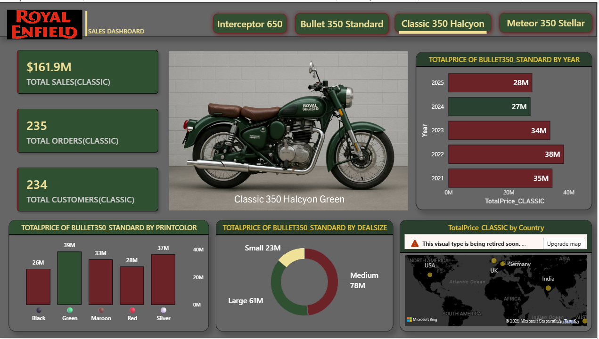
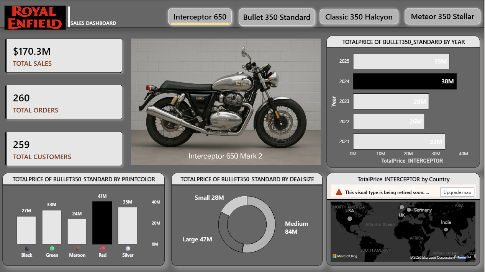
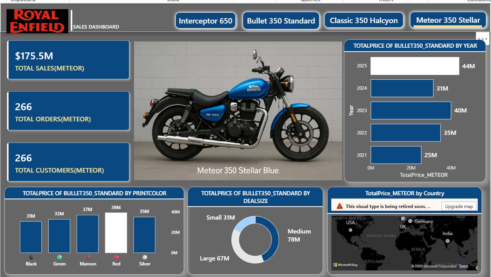
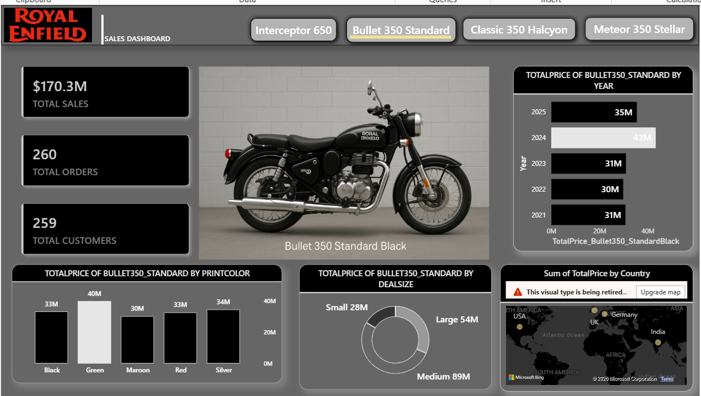
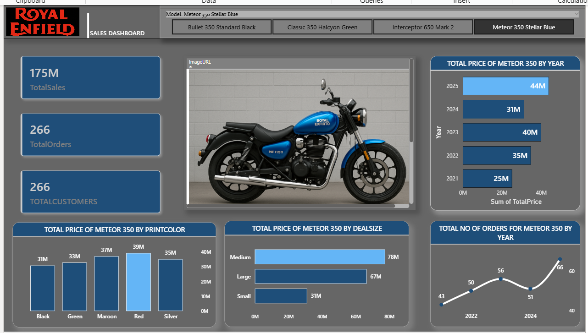

# 🏍️ Royal Enfield Sales Dashboard (Dynamic Power BI Project)

## 📌 Overview

This project presents an interactive Power BI dashboard designed to analyze Royal Enfield motorcycle sales across different models, countries, deal sizes, and product attributes.

The dashboard enables dynamic exploration of sales performance and provides actionable insights into trends, customer distribution, and product-level performance.

It demonstrates how a static multi-page report can be transformed into a scalable, dynamic, and user-friendly analytical solution.

---

## 📊 Key Features

* Built a dynamic single-page dashboard using slicers  
* Implemented model-based filtering (Bullet, Classic, Meteor, Interceptor)  
* Designed KPI cards for Total Sales, Orders, and Customers  
* Developed advanced DAX measures for dynamic calculations  
* Created year-wise sales trend analysis  
* Analyzed sales distribution by deal size and print color  
* Implemented conditional formatting based on selected model  
* Highlighted top-performing categories dynamically  
* Designed responsive and scalable report layout  
* Transformed a multi-page report into a scalable single-page dynamic dashboard  

---

## 🔄 Project Evolution

### 🔴 Initial Version (Multi-Page Dashboard)

* Separate pages for each model  
* Button-based navigation  
* Repetitive layout and difficult maintenance  
* Limited scalability  

### 🟢 Final Version (Dynamic Single-Page Dashboard)

* Converted into a single-page dashboard  
* Implemented slicer-based model selection  
* Dynamic visuals updating based on user interaction  
* Improved performance, usability, and scalability  
* Reduced redundancy and enhanced user experience  

---

## 📷 Dashboard Screenshots

### 🔴 Old Version (Multi-Page Design)









---

### 🟢 New Version (Dynamic Dashboard)



---

## 🧠 Key DAX Measures

### 🔢 Core Metrics

#### Total Sales
```DAX
TotalSales = SUM(bullet[TotalPrice])
```

#### Total Orders
```DAX
TotalOrders = DISTINCTCOUNT(bullet[OrderID])
```

#### Total Customers
```DAX
TotalCustomers = DISTINCTCOUNT(bullet[CustomerName])
```

---

### 🎯 Dynamic Titles

#### Dynamic Title (Year-wise Analysis)
```DAX
Dynamic Title Year =
"TOTAL PRICE OF " &
SWITCH(
    SELECTEDVALUE(bullet[Model]),
    "Classic 350 Halcyon Green", "CLASSIC 350",
    "Meteor 350 Stellar Blue", "METEOR 350",
    "Interceptor 650 Mark 2", "INTERCEPTOR 650",
    "Bullet 350 Standard Black", "STANDARD 350",
    "MODEL"
)
& " BY YEAR"
```

---

### 🎨 Dynamic Color Logic

#### Accent Color (Highlight Color)
```DAX
Accent Color =
SWITCH(
    SELECTEDVALUE(bullet[Model]),
    "Classic 350 Halcyon Green", "#8FBF9F",
    "Meteor 350 Stellar Blue", "#64B5F6",
    "Interceptor 650 Mark 2", "#000000",
    "Bullet 350 Standard Black", "#F4C430",
    "#CCCCCC"
)
```

#### Theme Color (Base Color)
```DAX
Theme Color =
SWITCH(
    SELECTEDVALUE(bullet[Model]),
    "Classic 350 Halcyon Green", "#2F5D3A",
    "Meteor 350 Stellar Blue", "#1E4E79",
    "Interceptor 650 Mark 2", "#B0B0B0",
    "Bullet 350 Standard Black", "#000000",
    "#888888"
)
```

---

### 🔥 Highlight Top Values (Advanced DAX)

#### Max Year Highlight Color
```DAX
max_year_colour =
VAR CurrentValue = SUM(bullet[TotalPrice])
VAR MaxValue =
    MAXX(
        ALLSELECTED(bullet[Year]),
        CALCULATE(SUM(bullet[TotalPrice]))
    )
RETURN
IF(
    CurrentValue = MaxValue,
    [Accent Color],
    [Theme Color]
)
```

---

## 🚀 What this demonstrates

- Strong understanding of DAX functions like SELECTEDVALUE, SWITCH, and MAXX  
- Ability to implement dynamic and context-aware reporting  
- Advanced conditional formatting and UI-driven design  
- Optimization of report structure for scalability and performance  
- Real-world dashboard design thinking and problem-solving approach  

---

## 🎨 Advanced Features

* Dynamic color themes based on selected model  
* Conditional formatting using DAX  
* Highlighting highest values in charts  
* Context-aware titles using SELECTEDVALUE  
* Interactive slicer-driven report behavior  

---

## 📊 Business Use Case

This dashboard enables business stakeholders to:

* Monitor and compare performance across different motorcycle models  
* Analyze sales trends and identify growth patterns  
* Identify high-performing product categories and customer segments  
* Evaluate regional sales distribution  
* Support data-driven strategic decision-making  

---

## 📈 Key Insights

* Identified top-performing motorcycle models based on revenue  
* Observed yearly sales trends and fluctuations  
* Analyzed demand variations across deal sizes and colors  
* Highlighted high-performing segments dynamically  

---

## 🛠 Tools Used

* Power BI  
* DAX (Data Analysis Expressions)  
* Data Modeling  
* Data Visualization  

---

## 📁 Files

- [RoyalEnfield_Sales_Dashboard.pbix](RoyalEnfield_Sales_Dashboard.pbix) – Power BI report

---

## ⚠️ Note

This project is created for learning and portfolio purposes using a synthetically generated dataset.

---

## 💡 Project Highlight

This project demonstrates the transformation of a traditional multi-page report into a dynamic, scalable, and user-centric Power BI dashboard using DAX and interactive design principles.


